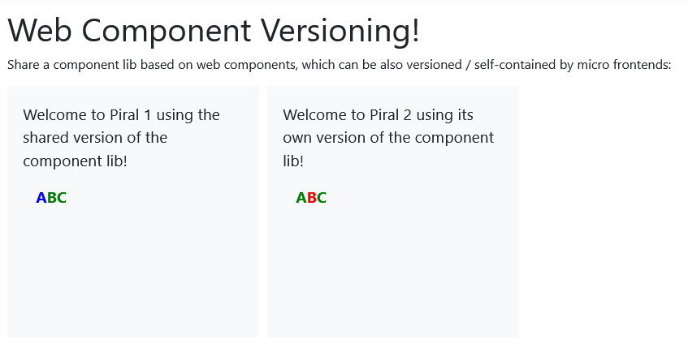

# Versioning Web Components

Over the last years web components have matured quite a bit. Still, there are areas where web components are unfortunately not yet easy to fit in. Surprisingly, micro frontends are one of the areas that actually do not only benefit from web components, but will also face real issues if used directly.

In this article we go into one of these troublesome use cases for web components arising with micro frontends. We'll cover how a web component-based component library can be used by multiple micro frontends in independent versions. But first, let's have a look at the problem in depth.

## Web Components and Versioning

Let's say you have two micro frontends - red and blue. Both want to use a component library. Let's just share it (green):


Since the component library is based on web components the shared part is actually trivial - they need to be shared. After all, to register a web component the following *global* call is made:

```js
customElements.define('my-component', MyComponent);
```

Both micro frontends can then access the `my-component` element. So far, this does not present any problem. But now, let's say the team behind the component library releases a new version.

While the red micro frontend actually wants to use this new version (purple), there is bug in a core component used by the blue micro frontend. So, at least for the time being, this team wants to remain on the old version.


This is a new version, yes, but the team wanted to keep breaking changes minimal. As such, both libraries want to register a different component to the same element name. Unfortunately, this is not supported and will throw:

```js
// called from v2
customElements.define('my-component', MyComponentV2);

// called from v1
customElements.define('my-component', MyComponentV1); //this will throw!
```

Even if the library has been developed defensively, it would not yield the right result:

```js
// called from v2
if (!customElements.get('my-component')) {
  customElements.define('my-component', MyComponentV2);
  // registered
}

// called from v1
if (!customElements.get('my-component')) {
  customElements.define('my-component', MyComponentV1);
  // never called, nothing registered
}
```

Now, both teams would unknowingly use the same component - but the blue micro frontend **explicitly** wanted to use the old v1 version.

Consequently, there must be a way to properly version and roll out the component library to support this use case.

## Challenges and Solutions

Alright, let's start with the most striking issue. What if we would just release with a certain version-dependent name?

```js
customElements.define('my-component-v2', MyComponentV2);
```

The granularity of this is debatable. Yes, the suffix could be used for API breaking changes, but what if there is some internal bug that was resolved in one version, but is included in another?

For instance, for a daily build we could define:

```js
customElements.define('my-component-2022-09-01', MyComponent);
```

Even though this might be as granular as possible, it would be pretty much unusable. Any update to the library would require changing all the references. Unless... we can make an alias. Can we?

```js
// original definition - very granular
customElements.define('my-component-2022-09-01', MyComponent);
// alias definition
customElements.define('my-component', MyComponent);
```

This has two problems:

1. By giving the alias a predefined name we run into the same problem that we want to avoid
2. A web component reference (the class behind it, i.e., `MyComponent` in the example above) can only be used *once*

The latter can be fixed by using an anonymous class extending the original class:

```js
// original definition - very granular
customElements.define('my-component-2022-09-01', MyComponent);
// alias definition
customElements.define('my-component', class extends MyComponent {});
```

Now we are left with the first issue. This one could be solved by making the alias registration configurable:

```js
// original definition - very granular
customElements.define('my-component-2022-09-01', MyComponent);

export function registerComponent(name = 'my-component') {
  // alias definition
  customElements.define(name, class extends MyComponent {});
}
```

This way, the default version of the component library will be auto-registered (e.g., using `registerComponent()` implicitly), while the blue micro frontend will use the custom registration, explicitly calling `registerComponent` with a new name for the component.


From the perspective of the blue micro frontend the code could look like:

```js
import { registerComponent } from 'component-lib/custom';

registerComponent('other-component');
```

Great! So we can define aliases, but does that fully help us?

It turns out there are a couple of issues with this approach:

1. If we do not isolate the styling (e.g., instead of using shadow DOM we use `innerHTML` or similar) we have trouble identifying the element by a fixed tag name
2. If within the component library we reference some component by its tag name then we have an issue

To solve the first problem we can either introduce class names, inline styling, or CSS-in-JS. The former two have the issue that their specifity is quite high, i.e., in order to override the styling (which presumably is wanted in such cases, otherwise using shadow DOM would be preferred I guess) the use of `!important` would be necessary.

Using a CSS-in-JS solution, however, makes sense for web components. They should anyway be styled by some mechanism (e.g., lit styles) that is close / defined within JS.

So we could just do the following:

```js
function getSheet() {
  const element = document.createElement('style');
  document.head.prepend(element);
  return element.sheet;
}

function defineComponent(name, BaseClass) {
  // wrapper to always succeed here
  if (!customElements.get(name)) {
    const sheet = getSheet();
    customElements.define(name, class extends BaseClass {});
    sheet.insertRule(`${name} { ${BaseClass.styles || ''} }`, 0);
  }
}

// default definition
defineComponent('my-component-2022-09-01', MyComponent);

export function registerComponent(name = 'my-component') {
  // alias definition
  defineComponent(name, MyComponent);
}
```

where we expect the given component class (e.g., `MyComponent`) to have a static `styles` property like this:

```js
export class MyComponent extends HTMLElement {
  static styles = `
    color: green;
    font-weight: bold;
  `;
}
```

This way, we can apply some default styling exactly to the registered tag name. Even better, if we register the element multiple times then each gets the default styling applied - independently of each other. Hence, overriding the styles of one tag does not impact the others.

That only leaves us with the reference problem. Here, we need to stay consistent. The following diagram illustrates this:


Using a `x-button-group` component from both, the red and the blue, micro frontends is only possible if we follow the steps we derived so far. We require a dedicated name for the embedded version used in the blue micro frotend. But that is not everything: Inside the `x-button-group` we also need to reference whatever tags have been defined outside (in our case: the blue micro frontend). Well, this is a challenge.

One way out of this is to keep book of the context. Inside the component we always know our tag:

```js
export class MyComponent extends HTMLElement {
  constructor() {
    super();
    // this will log the currently used name, e.g., `x-button-group` or `x-button-group-v1`
    console.log(this.localName); // "x-button-group"
  }
}
```

Now we can use this information if we perform a joint registration like so:

```js
const contexts = [];
const components = {
  'x-button': Button,
  'x-button-group': ButtonGroup,
};

export function registerComponents(getName = (name) => name) {
  const tagNames = [];
  const aliases = {};

  Object.entries(components).forEach(([name, cls]) => {
    const tag = getName(name);
    aliases[name] = tag;
    tagNames.push(tag);
    defineComponent(tag, cls);
  });

  contexts.push({ tagNames, aliases });
}
```

We get aliases and tags.


By using the `localName` from the current component *instance* to match the provided tags (we guarantee that it appears once and only once) we find the right context, giving us the aliases. So, for the `ButtonGroup` to find the correct name of a `Button` we can use:

```js
export function findTagName(localName, defaultName) {
  // get the right context - we are only interested in its aliases
  const { aliases } = contexts.find(c => c.tagNames.includes(localName));
  // resolve the current tag name from the provided alias mapping
  return aliases[defaultName];
}
```

This is pretty much all that's necessary to cover the most important use cases. Let's see this in action.

## Demo Project

I've prepared a demo project on the basis of [Piral](https://github.com/smapiot/piral). The running demo can be found at [the Piral samples organization on GitHub](https://github.com/piral-samples). Running the demo locally does not look very spectacular.



In the end, we have two micro frontends contained in one application. One micro frontend is using the embedded / centrally provided version of a web component library (`lib-v1`), while the other one is using its own version (`lib-v2`).

The setup of the first micro frontend is:

```js
import "./style";
import * as React from "react";

export function setup(app) {
  app.registerTile(
    () => (
      <div className="teaser">
        Welcome to Piral 1 using the shared version of the component lib!
        <lib-container>
          <lib-button-group></lib-button-group>
        </lib-container>
      </div>
    ),
    {
      initialColumns: 4,
      initialRows: 4,
    }
  );
}
```

Here, `lib-container` and `lib-button-group` are used. These are components from the web component library. While the `lib-container` uses a shadow DOM for styling and a `<slot>` for its children, the `lib-button-group` redefines its content by setting the `innerHTML` property. The latter has therefore to be styleable from the outside. Also, it directly references `lib-button` internally.

The setup of the second micro frontend is:

```js
import "./style";
import { registerAll } from "lib-v2/register";
import * as React from "react";

registerAll((name) => `new-${name}`);

export function setup(app) {
  app.registerTile(
    () => (
      <div className="teaser">
        Welcome to Piral 2 using its own version of the component lib!
        <new-lib-container>
          <new-lib-button-group></new-lib-button-group>
        </new-lib-container>
      </div>
    ),
    {
      initialColumns: 4,
      initialRows: 4,
    }
  );
}
```

Pretty much the same, except that we use the `lib-v2/register` module instead of just importing `lib-v2`. Then, this micro frontend uses the imported `registerAll` function to actually alias all these components.

The result is that both library versions co-exist, and can even be styled independently, e.g.:

```css
/* mf-one */
lib-button:nth-child(1) {
  color: blue;
}

/* mf-two */
new-lib-button:nth-child(2) {
  color: red;
}
```

The demo also includes components written using Lit. For Lit a couple of things need to be respected:

1. Components should not be registered right away (i.e., drop the decorator)
2. The dynamically resolved tag names need to be included via unsafe constructs

The unsafe constructs can be done in Lit like this:

```js
import { LitElement, html, css } from "lit";
import { unsafeHTML } from "lit/directives/unsafe-html.js";
import { getAlias } from "./aliases";
import { buttonTag } from "./Button";

export class ButtonGroup extends LitElement {
  render() {
    const button = getAlias(this.localName, buttonTag);
    const code = unsafeHTML(
      `<div><${button}>A</${button}><${button}>B</${button}><${button}>C</${button}></div>`
    );
    return html`${code}`;
  }
}

export const buttonGroupTag = "lib-button-group";
```

There could be even more convenient wrappers on top of this, like

```js
function renderFragment(localName, defaultTag, content) {
  const tag = getAlias(localName, defaultTag);
  const code = unsafeHtml(`<${tag}>${content}</${tag}>`);
  return html`${code}`;
}
```

The result is a DOM as we want it:


## Conclusion

With the right utility functions and architectural decisions you can create a library consisting of web components that can be used in quite flexible ways. The key question is if you want or need to support that use case.

My personal preference is to always stay agile. Allowing different teams to make their own decisions what usage of your library fits best to their use case is always a good goal to have in mind.
